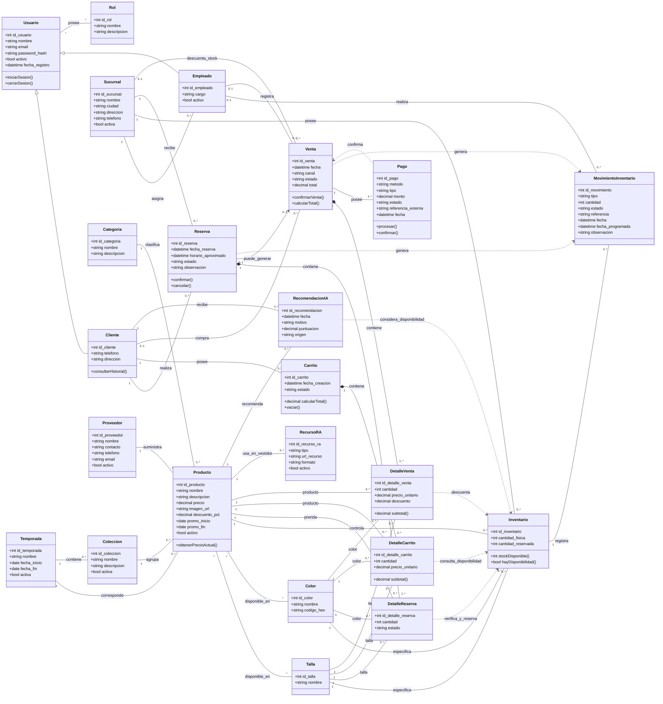

# FashionStore — Diagrama de clases UML (MVP)

> Modelo simplificado de **23 clases**, pensado para el MVP académico de FashionStore.  
> Formato: **Mermaid Class Diagram**, portable a Mermaid Live Editor, Mermaid Chart, VS Code, Obsidian, GitHub y herramientas compatibles.



---

## Clases incluidas

| # | Clase | Responsabilidad principal |
|---:|---|---|
| 1 | `Usuario` | Credenciales y acceso al sistema |
| 2 | `Cliente` | Datos y acciones del comprador |
| 3 | `Empleado` | Personal de la empresa |
| 4 | `Rol` | Administrador, encargado, cajero, etc. |
| 5 | `Sucursal` | Tiendas físicas por ciudad |
| 6 | `Categoria` | Clasificación de prendas |
| 7 | `Temporada` | Primavera-verano, otoño-invierno, escolar, etc. |
| 8 | `Coleccion` | Agrupación comercial de productos |
| 9 | `Proveedor` | Proveedor de prendas |
| 10 | `Talla` | Tallas disponibles |
| 11 | `Color` | Colores disponibles |
| 12 | `Producto` | Prenda del catálogo y promoción simplificada |
| 13 | `Inventario` | Existencias por producto, talla, color y sucursal |
| 14 | `MovimientoInventario` | Entradas, salidas, reservas, devoluciones y ajustes |
| 15 | `Reserva` | Reserva de prendas para prueba en tienda |
| 16 | `DetalleReserva` | Prendas incluidas en una reserva |
| 17 | `Carrito` | Carrito de compra del cliente |
| 18 | `DetalleCarrito` | Productos del carrito |
| 19 | `Venta` | Compra presencial, web o móvil |
| 20 | `DetalleVenta` | Productos vendidos |
| 21 | `Pago` | Pago en caja o por pasarela electrónica |
| 22 | `RecursoRA` | Recurso usado por el vestidor virtual |
| 23 | `RecomendacionIA` | Resultado de recomendación inteligente |

---

## Decisiones de simplificación para el MVP

### 1. Promociones
No se crea una clase `Promocion`. Para el MVP, `Producto` contiene:

- `descuento_pct`
- `promo_inicio`
- `promo_fin`

Esto permite demostrar la gestión de promociones sin agregar otra entidad.

### 2. Variantes de producto
No se crea una clase `VarianteProducto`. La combinación concreta se controla mediante:

**Producto + Talla + Color + Sucursal → Inventario**

Así se puede consultar, por ejemplo:

> Camisa Oxford / talla M / color azul / Sucursal Centro / 5 unidades disponibles.

### 3. Devoluciones y recepción de productos
No se crean clases independientes. Se registran mediante `MovimientoInventario`.

Valores sugeridos para `tipo`:

- `ENTRADA`
- `VENTA`
- `RESERVA`
- `LIBERACION_RESERVA`
- `DEVOLUCION`
- `AJUSTE`
- `INGRESO_PENDIENTE`

### 4. Tipos de venta
Se utiliza una sola clase `Venta`.

Valores sugeridos para `canal`:

- `PRESENCIAL`
- `WEB`
- `MOVIL`

### 5. Pagos
Se utiliza una sola clase `Pago`.

Valores sugeridos para `metodo`:

- `EFECTIVO`
- `TARJETA`
- `QR`
- `TRANSFERENCIA`
- `PASARELA`

Valores sugeridos para `tipo`:

- `PRESENCIAL`
- `ELECTRONICO`

### 6. Estados de reserva
Valores sugeridos:

- `PENDIENTE`
- `PREPARANDO`
- `LISTA`
- `CLIENTE_PRESENTE`
- `ATENDIDA`
- `CANCELADA`
- `VENCIDA`

### 7. Estados de pago
Valores sugeridos:

- `PENDIENTE`
- `APROBADO`
- `RECHAZADO`
- `ANULADO`

### 8. Inteligencia artificial
`RecomendacionIA` almacena el resultado de una recomendación.  
La lógica de IA se implementará como un **servicio externo/API**, por lo que no es necesario modelar internamente modelos, datasets o entrenamiento.

### 9. Vestidor virtual
`RecursoRA` representa el recurso que React Native utilizará para mostrar una prenda mediante realidad aumentada. La implementación concreta del motor RA no necesita convertirse en una entidad del dominio.

### 10. Reportes y dashboards
No se crean clases `Reporte` o `Dashboard`. Los indicadores se obtienen consultando:

- `Venta`
- `Inventario`
- `Reserva`
- `Producto`
- `Sucursal`

---

## Restricción principal de inventario

En la base de datos, la combinación siguiente debería ser única:

```text
(id_sucursal, id_producto, id_talla, id_color)
```

De esta manera no pueden existir dos registros distintos de inventario para exactamente la misma prenda, talla, color y sucursal.

La disponibilidad puede calcularse como:

```text
stock_disponible = cantidad_fisica - cantidad_reservada
```

---

## Cobertura funcional del modelo

| Funcionalidad solicitada | Clases principales |
|---|---|
| Registro y acceso | `Usuario`, `Cliente` |
| Usuarios y roles | `Usuario`, `Empleado`, `Rol` |
| Ciudades y sucursales | `Sucursal` |
| Catálogo | `Producto`, `Categoria`, `Talla`, `Color` |
| Temporadas y colecciones | `Temporada`, `Coleccion` |
| Proveedores | `Proveedor`, `Producto` |
| Disponibilidad por sucursal | `Inventario`, `Sucursal` |
| Reservar varias prendas | `Reserva`, `DetalleReserva` |
| Preparación y atención de reserva | `Reserva`, `Empleado`, `Sucursal` |
| Vestidor virtual | `Producto`, `RecursoRA` |
| Carrito | `Carrito`, `DetalleCarrito` |
| Venta web | `Venta` con canal `WEB` |
| Venta móvil | `Venta` con canal `MOVIL` |
| Venta presencial | `Venta` con canal `PRESENCIAL` |
| Pago presencial | `Pago` |
| Pasarela electrónica | `Pago` |
| Actualización de inventario | `Inventario`, `MovimientoInventario` |
| Devoluciones | `MovimientoInventario` |
| Recepción de mercadería | `MovimientoInventario` |
| Promociones | atributos de `Producto` |
| Recomendaciones con IA | `RecomendacionIA` |
| Reportes / dashboard | consultas sobre ventas, inventario y reservas |

---

## Nota para la implementación

Este diagrama representa el **modelo de dominio del MVP**. No significa que cada servicio tecnológico deba convertirse en una tabla.

Elementos como:

- NestJS
- React
- React Native
- PostgreSQL
- pasarela de pago
- servicio de IA
- motor de realidad aumentada

pertenecen principalmente a la **arquitectura e implementación** y se modelarán posteriormente mediante componentes, servicios, APIs y despliegue.
